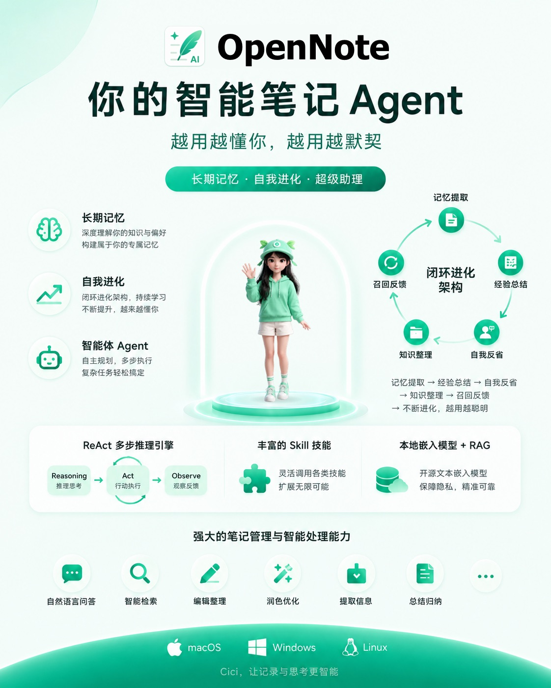
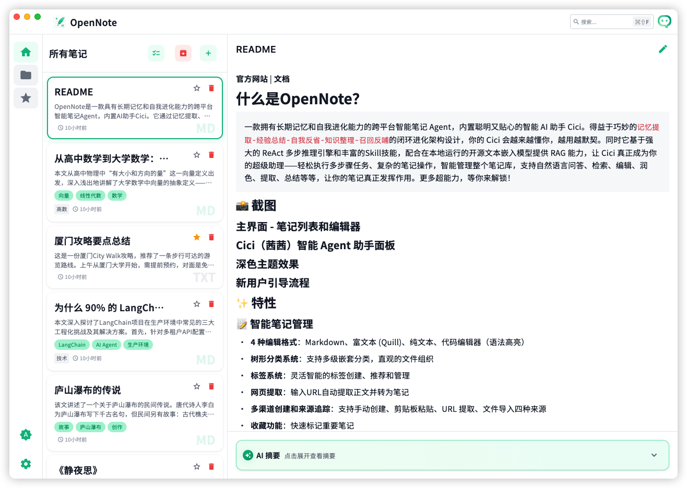
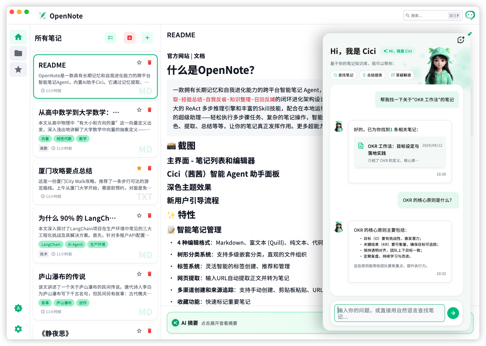
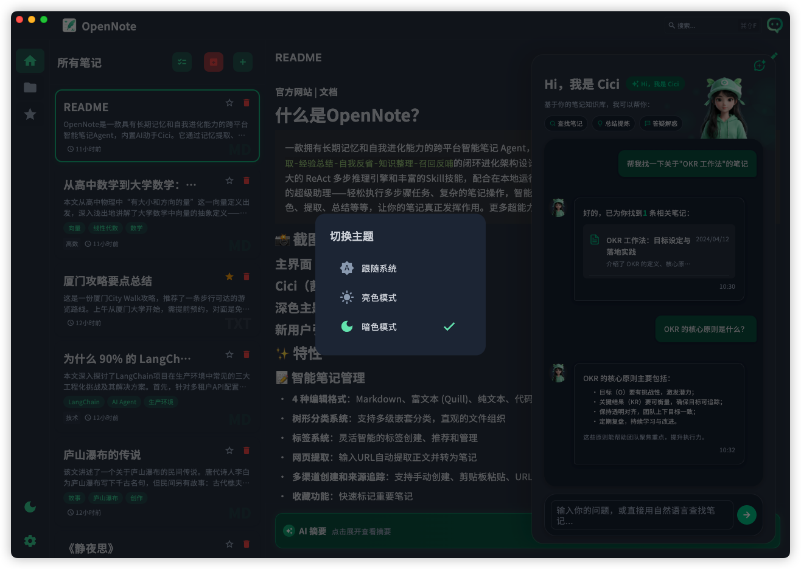
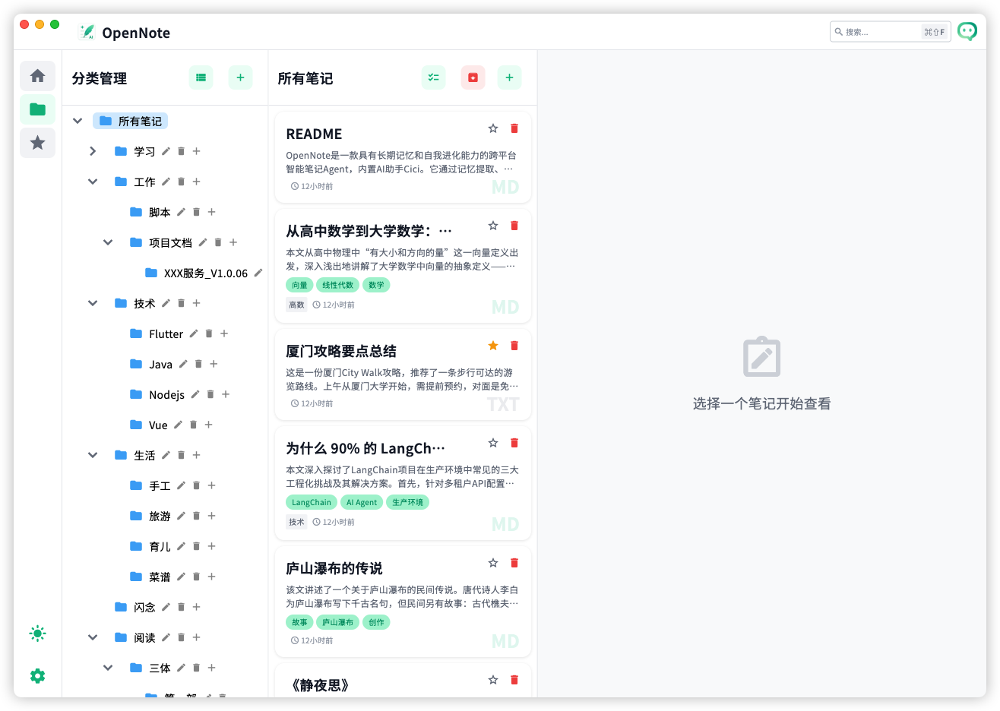
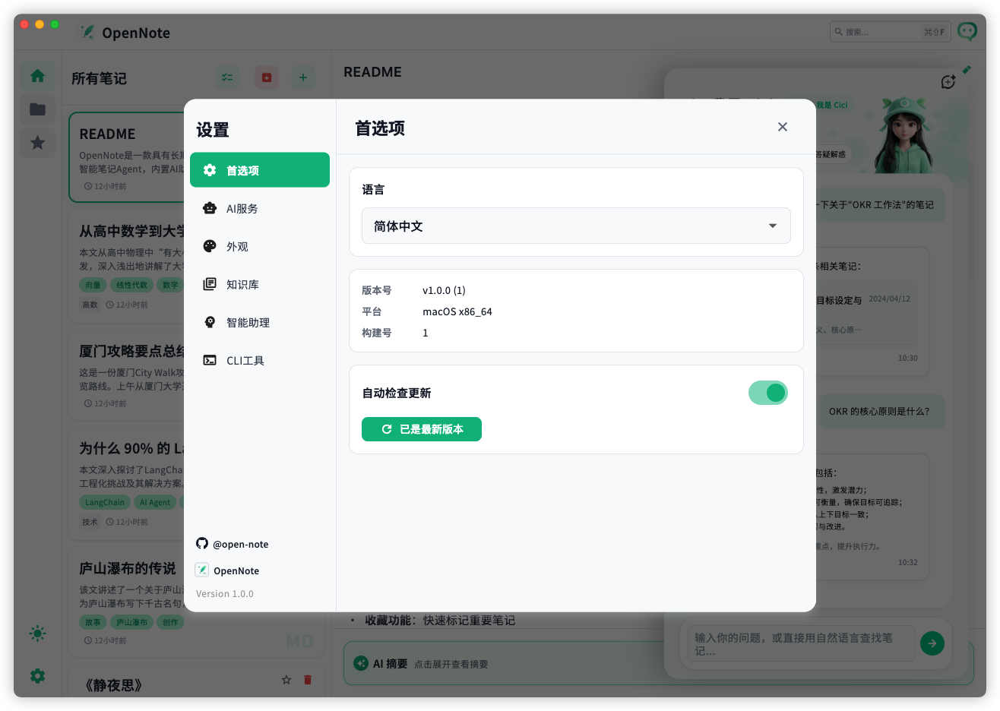

<p align="center">
  
</p>

<span align="center">

[**官方网站**](https://opennote.zsdn.net/) | [**文档**](https://docs.opennote.zsdn.net/) 

</span>

<p align="center">
    <a href="https://pypi.org/project/open-note-cli/">
        
    </a>
    <a href="https://docs.opennote.zsdn.net/">
        
    </a>
    <a href="https://github.com/The-Flash-7/open-note/releases/tag/v1.0.0">
        
    </a>
    <a href="https://pypi.org/project/open-note-cli/">
        
    </a>
    <a href="https://pypi.org/project/open-note-mcp/">
        
    </a>
    <a href="./LICENSE">
        
    </a>
</p>

# 什么是OpenNote？

> 一款拥有长期记忆和自我进化能力的跨平台智能笔记 Agent，内置聪明又贴心的智能 AI 助手 Cici。得益于巧妙的`记忆提取-经验总结-自我反省-知识整理-召回反哺`的闭环进化架构设计，你的 Cici 会越来越懂你，越用越默契。同时它基于强大的 ReAct 多步推理引擎和丰富的Skill技能，配合在本地运行的开源文本嵌入模型提供 RAG 能力，让 Cici 真正成为你的超级助理——轻松执行多步骤任务、复杂的笔记操作，智能管理整个笔记库，支持自然语言问答、检索、编辑、润色、提取、总结等等，让记录与思考更智能！更多超能力✨，等你来解锁！



## ✨ 特性

### 📝 智能笔记管理

- **4 种编辑格式**：Markdown、富文本 (Quill)、纯文本、代码编辑器（语法高亮）
- **树形分类系统**：支持多级嵌套分类，直观的文件组织
- **标签系统**：灵活智能的标签创建、推荐和管理
- **网页提取**：输入URL自动提取正文并转为笔记
- **多渠道创建和来源追踪**：支持手动创建、剪贴板粘贴、URL 提取、文件导入四种来源
- **收藏功能**：快速标记重要笔记
- **AI智能**：AI智能建议、关键词提取和摘要生成

### 🤖 Cici（茜茜）智能 Agent 助手

- **对话式 AI 助手**：基于你的笔记知识库进行智能问答
- **ReAct 推理引擎**：AI 通过「思考→行动→观察」循环，自动完成复杂任务
- **21 个自动化技能**：

  | 类别    | 技能 |
  |-------|------|
  | 🔍 搜索 | 关键词搜索、标题搜索、向量语义搜索 |
  | 📖 读取 | 读取笔记内容、获取笔记格式 |
  | ✏️ 编辑 | 编辑笔记内容、修改基本信息 |
  | ➕ 创建  | 新建笔记、从 URL 自动抓取创建 |
  | 🗑️ 删除 | 删除笔记 |
  | 🔀 合并 | 合并多篇笔记 |
  | 📊 列表 | 最近笔记、分类浏览、标签浏览 |
  | 💬 问答 | 基于笔记内容的智能问答 |
  | ✨ 改写  | 改写润色笔记内容 |
  | 📋 总结 | 自动总结提炼核心内容 |
  | 🔑 关键词 | 自动提取关键词 |
  | 📂 打开 | 直接打开目标笔记 |

- **工具执行日志**：实时展示 AI 的每一步操作，透明可追溯

### 🧠 智能记忆系统

- **自动记忆提取**：从对话中自动提取用户偏好、事实和经验总结
- **触发机制**：关键词即时触发 + 每 5 轮对话批量触发
- **记忆类型**：用户画像 (profile)、事实 (fact)、经验 (experience)
- **记忆注入**：AI 推理时按需注入相关记忆，提供个性化服务
- **置信度衰减**：基于访问时间自动衰减的遗忘策略，过期自动清理

### 🔎 向量语义搜索

- **ChromaDB 向量数据库**：本地持久化存储
- **ONNX Embedding**：支持本地模型或 API 两种方式
- **内置开源文本嵌入模型**：Google DeepMind 推出的开源轻量级文本嵌入模型`embeddinggemma-300m`
- **混合搜索**：关键词 + 语义搜索，使用 RRF 算法融合结果
- **自动索引**：笔记保存时自动分块向量化索引
- **富文本支持**：Quill Delta JSON 自动提取纯文本索引

### 🎨 用户体验

- **深色/浅色主题**：完整的主题系统，支持自动跟随系统
- **响应式设计**：桌面端完美适配，支持平板模式
- **引导流程**：新用户快速上手配置 AI 提供商
- **全局快捷键**：`Cmd/Ctrl+Shift+F` 全局搜索、`Cmd/Ctrl+O` 文件导入
- **剪贴板智能**：自动识别粘贴内容中的 URL，一键提取网页正文
- **文件拖放**：直接拖拽文件到应用导入

### 🔌 开放扩展

- **多 AI 提供商**：DeepSeek、OpenAI、Claude (Anthropic)、百炼、智谱、百度、混元、Kimi、火山、Ollama (本地)、自定义兼容 API
- **MCP 协议支持**：兼容 Model Context Protocol
- **CLI 命令行工具**：支持终端操作笔记

## 📸 界面预览

### 主界面 - 笔记列表和编辑器



### Cici（茜茜）智能 Agent 助手面板



### 深色主题效果



### 类目管理



### 设置面板



## 🚀 快速开始

### 系统要求

- **macOS** 12.0+ / **Windows** 10+ / **Linux** (Ubuntu 20.04+)

### 安装

1. 从 [Releases](https://github.com/The-Flash-7/open-note/releases) 下载对应平台的安装包
2. 安装并启动应用
3. 按照引导完成 AI 提供商配置
4. 首次启动会自动初始化文本嵌入向量服务

### AI 服务商配置

OpenNote 预设支持多种 AI 服务商，开箱即用：

| 服务商                           | 类型 | 说明 |
|-------------------------------|------|------|
| [DeepSeek](https://platform.deepseek.com/) | 云端 | DeepSeek V4 Flash / V4 Pro |
| [OpenAI](https://platform.openai.com) | 云端 | GPT-5.5 / GPT-5.4 / GPT-5.3 / GPT-5.2 / GPT-4o / GPT-4 / GPT-3.5 |
| [阿里云百炼 Token Plan](https://bailian.console.aliyun.com/) | 云端 | Qwen / GLM / MiniMax / DeepSeek 等多模型 |
| [阿里云百炼 Coding Plan](https://bailian.console.aliyun.com/) | 云端 | Qwen3 Coder / GLM / Kimi / MiniMax 等编程优化模型 |
| [火山方舟 Coding Plan](https://www.volcengine.com/activity/codingplan) | 云端 | 豆包 Seed / MiniMax / GLM / DeepSeek / Kimi 等 |
| [腾讯混元](https://cloud.tencent.com/product/tokenhub) | 云端 | Lite / Standard / Pro / Turbo |
| [火山豆包](https://www.volcengine.com/product/doubao) | 云端 | Doubao Pro 32K / Lite 32K / Pro 128K |
| [智谱 GLM Coding Plan](https://bigmodel.cn/glm-coding) | 云端 | GLM-5.1 / GLM-5-Turbo / GLM-4.7 等编程优化模型 |
| [智谱 GLM](https://open.bigmodel.cn/) | 云端 | GLM-4 / GLM-4-Flash / GLM-4-Plus / GLM-3-Turbo |
| [百度千帆](https://cloud.baidu.com/product-s/qianfan_home) | 云端 | ERNIE-Bot-4 / ERNIE-Bot / ERNIE-Bot-Turbo |
| [Moonshot (Kimi)](https://platform.moonshot.cn/) | 云端 | Moonshot-v1 8K / 32K / 128K |
| [Claude (Anthropic)](https://console.anthropic.com/) | 云端 | Claude 3.5 Sonnet / Claude 3.5 Haiku / Claude 3 Opus |
| [Ollama](https://ollama.com/) | 本地 | Llama 3 / Llama 2 / Mistral / CodeLlama / Qwen 2 等 |
| 完全自定义                         | 云端/本地 | 兼容 OpenAI API 格式的任何服务，可自定义厂商、URL 和模型 |

注：本预设列表无模型能力排名的含义

## 📦 技术栈

| 类别                | 技术                                                       |
|-------------------|----------------------------------------------------------|
| **框架**            | Flutter 3.11.5+ (Dart)                                   |
| **状态管理**          | Provider                                                 |
| **数据存储**          | SQLite 数据库                                               |
| **AI 服务**         | OpenAI 兼容 API / Anthropic / Ollama 等                     |
| **向量数据库**         | ChromaDB (Embedding 服务)                                  |
| **RAG Embedding** | ONNX Runtime (本地) 开源`embeddinggemma-300m`文本嵌入模型          |
| **编辑器**           | flutter_quill, markdown_editor_plus, flutter_code_editor |
| **Python 服务**     | FastAPI, Uvicorn, ChromaDB, ONNX Runtime                 |
| **CI/CD**         | GitHub Actions                                           |
| **打包**            | PyInstaller (Python), Flutter Build (应用)                 |

## 📂 项目结构

```
open-note/
├── lib/                          # Flutter 源代码
│   ├── models/                   # 数据模型
│   │   ├── note.dart             # 笔记模型
│   │   ├── category.dart         # 分类模型
│   │   ├── tag.dart              # 标签模型
│   │   ├── chat_message.dart     # 聊天消息模型
│   │   ├── agent_memory.dart     # Agent 记忆模型
│   │   └── ai_provider_config.dart  # AI 提供商配置
│   ├── providers/                # 状态管理
│   │   ├── notes_provider.dart
│   │   ├── settings_provider.dart
│   │   ├── theme_provider.dart
│   │   ├── tags_provider.dart
│   │   ├── category_provider.dart
│   │   ├── knowledge_base_provider.dart
│   │   ├── memory_settings_provider.dart
│   │   └── background_summary_provider.dart
│   ├── screens/                  # 主屏幕
│   │   ├── home_screen.dart      # 主页
│   │   └── editor_screen.dart    # 编辑器
│   ├── services/                 # 核心服务
│   │   ├── ai_service.dart       # AI API 调用
│   │   ├── cici_agent.dart       # Cici Agent
│   │   ├── react_engine.dart     # ReAct 推理引擎
│   │   ├── memory_extractor.dart # 记忆提取
│   │   ├── vector_store.dart     # 向量存储
│   │   ├── semantic_search.dart  # 语义搜索
│   │   ├── sqlite_database_service.dart  # SQLite 数据库
│   │   ├── python_service_manager.dart # Python 服务管理
│   │   ├── skills/               # 技能系统
│   │   │   ├── skill_registry.dart
│   │   │   ├── skill_executor.dart
│   │   │   └── skills/           # 21 个具体技能实现
│   │   └── prompts/              # AI 提示词模板
│   ├── widgets/                  # UI 组件 (100+)
│   │   ├── ai/cici/              # Cici AI 助手面板
│   │   ├── editors/              # 4 种编辑器组件
│   │   ├── category/             # 分类相关组件
│   │   ├── navigation/           # 导航组件
│   │   ├── onboarding/           # 新用户引导
│   │   └── ...
│   ├── theme/                    # 主题和设计令牌
│   └── utils/                    # 工具类
├── embedding_service/            # 向量嵌入服务
│   ├── main.py                   # FastAPI 入口
│   └── embedding/                # Embedding 和向量搜索
├── assets/                       # 静态资源
│   ├── fonts/                    # 字体 (JetBrains Mono, Noto Sans SC)
│   ├── images/                   # 图片资源
│   └── svg/                      # SVG 图标
├── scripts/                      # 构建脚本
├── docs/                         # 项目文档
├── macos/ windows/ linux/        # 平台原生代码
├── packages                      # 扩展工具
│   ├── open-note-core/           # 扩展工具核心包
│   ├── open-note-mcp/            # mcp 服务器
│   └── open-note-cli/            # cli 终端工具
└── .github/workflows/            # CI/CD 配置
```

## 开发指南
[开发指南](DEV_GUIDE.md)

## 🤝 贡献

欢迎提交 Issue 和 Pull Request！

## 📄 许可证

本项目采用 **MIT License** 和 **Apache License 2.0** 双许可证。
你可以选择其中任一许可证的条款来使用本项目。

- 详见 [LICENSE-MIT](LICENSE-MIT)
- 详见 [LICENSE-APACHE](LICENSE-APACHE)

---

**OpenNote** - 不是记笔记，而是用笔记。
